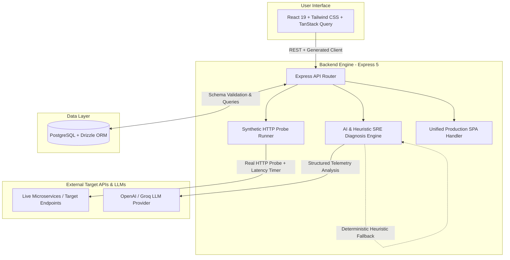

# ContractLens

<p align="center">
  <strong>API Reliability & Contract Intelligence for Engineering Teams</strong><br />
  Detect silent schema drift, track service health, and diagnose incidents with evidence-backed AI before consumers break.
</p>

<p align="center">
  
  
  
  
  
  
  
</p>

---

## Why ContractLens

Traditional uptime monitoring answers a simple binary question: *Is the endpoint responding with HTTP 200?*

It **fails silently** when:
- A deployment drops a required field (`currency`, `order_id`) while still returning `200 OK`.
- Upstream type alterations cause downstream microservices or mobile clients to crash.
- Schema regressions go undetected until customer tickets flood support queues.

**ContractLens** bridges this gap. It continuously monitors live endpoints, validates HTTP payloads against contract schemas, correlates anomalies with deployment events, and produces automated, evidence-backed SRE root-cause diagnoses.

---

## Architecture & Data Flow



---

## Key Capabilities

- **Reliability Overview** — Global uptime, p50 latency sparklines, error rates, service health status, and active incident signal.
- **Service Catalog** — Ownership, endpoint coverage, health status, and performance SLAs across services.
- **API Checks** — HTTP method, endpoint, status, real network latency measurement, success rate, and historical run tracking.
- **Incident Management** — Severity, status, error rates, duration, timeline events, and correlated failing checks.
- **AI & Deterministic SRE Diagnosis** — Probable cause, confidence scoring, actionable recommendations, and telemetry evidence (with automatic heuristic fallback when no LLM API key is present).
- **Contract-First API** — OpenAPI 3.1 is the single source of truth for generated client hooks, request/response Zod schemas, and TypeScript interfaces.
- **Single-Service Production Deployment** — Express 5 serves both the compiled Vite React 19 SPA and API routes with zero CORS overhead and complete SPA client-side routing fallback.

## Technology Stack

- **Frontend**: React 19, TypeScript, Vite, Tailwind CSS, Lucide Icons, Radix UI primitives
- **Backend API**: Express 5, Pino Logger, OpenAPI 3.1
- **Database & ORM**: PostgreSQL with SSL Connection Pooling, Drizzle ORM, `drizzle-zod`
- **Contract Code-Gen**: OpenAPI 3.1, Orval, Zod
- **Server State**: TanStack React Query v5
- **Diagnostics**: OpenAI SDK (GPT-4o / GPT-5-mini / Groq) + Fallback SRE Heuristic Engine
- **DevOps & Testing**: Multi-stage Docker, Docker Compose, GitHub Actions CI, Node.js Test Runner

---

## Getting Started

### Local Development

#### Prerequisites
- Node.js 20+
- pnpm (`npm install -g pnpm`)
- PostgreSQL database

#### Setup

```bash
# 1. Install dependencies
pnpm install

# 2. Configure environment variables (see .env.example)
cp .env.example .env

# 3. Push database schema
pnpm db:push

# 4. Start development servers
pnpm dev             # Starts backend API (port 5000)
pnpm dev:frontend    # Starts frontend with HMR (port 5173)
```

The web dashboard is available at `http://localhost:5173` with automatic API reverse-proxying to `http://localhost:5000`.

### Docker Compose

Run ContractLens alongside a PostgreSQL instance:

```bash
docker compose up --build
```

The application will be accessible at `http://localhost:5000`.

---

## Available Scripts

| Script | Purpose |
|---|---|
| `pnpm dev` | Start backend API server with live watch mode |
| `pnpm dev:frontend` | Start Vite React dev server with Hot Module Replacement |
| `pnpm build` | Typecheck and build libraries, frontend, and server bundles |
| `pnpm start` | Run compiled production bundle |
| `pnpm test` | Run automated test suites |
| `pnpm typecheck` | Run strict TypeScript compiler verification across workspace |
| `pnpm db:push` | Push Drizzle ORM schema migrations to PostgreSQL |

---

## API Reference

The contract lives in `lib/api-spec/openapi.yaml`.

| Method | Endpoint | Description |
|---|---|---|
| `GET` | `/healthz` | Container and load-balancer health probe |
| `GET` | `/api/dashboard` | Workspace reliability overview, uptime, and 24h trends |
| `GET` | `/api/services` | Service catalog, owners, and SLA metrics |
| `POST` | `/api/services` | Register a new monitored service |
| `GET` | `/api/checks` | List configured synthetic contract checks |
| `POST` | `/api/checks/:checkId` | Trigger an immediate live contract check execution |
| `GET` | `/api/incidents` | List active and resolved reliability incidents |
| `GET` | `/api/incidents/:id` | Get incident details, timeline events, and affected checks |
| `PATCH` | `/api/incidents/:id` | Update incident status or resolution details |
| `POST` | `/api/incidents/:id/diagnose` | Run AI / SRE heuristic root-cause diagnosis |

---

## Project Structure

| Path | Responsibility |
|---|---|
| `artifacts/contract-lens` | React 19 / Vite product interface |
| `artifacts/api-server` | Express 5 API, probe runner, and SRE diagnosis workflow |
| `lib/api-spec` | OpenAPI 3.1 source contract |
| `lib/api-client-react` | Generated React Query client hooks |
| `lib/api-zod` | Generated request and response validation schemas |
| `lib/db` | PostgreSQL connection pool and Drizzle schema |

---

## License

MIT © 2026 Sushant